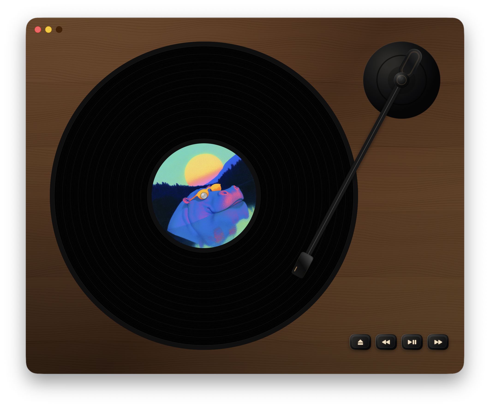

# Scamp Micro Deck

Scamp Micro Deck is a native macOS music player for local folders of audio files, designed to mimic the tedious charm of a real vinyl record player.

<!-- markdownlint-disable MD033 -->

  

  

<!-- markdownlint-enable MD033 -->

## Contributing

Issues and PRs welcome.

Tools:

- `mise build` - build the macOS app bundle
- `mise start` - stop, rebuild, and launch the app
- `mise xcode` - open the project in Xcode

## License

MIT
