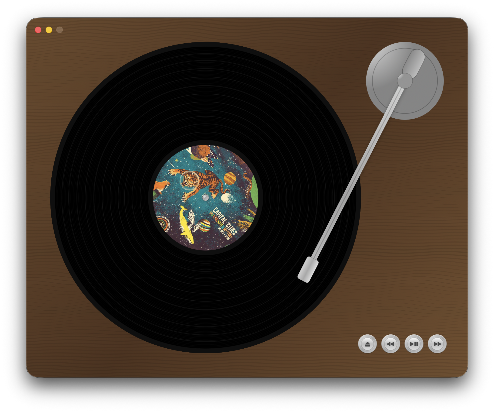

# About

Scamp is a native macOS music player meant to emulate all the tedious, crappy charm of a real vinyl record player. I built this so that I don't need to spend a bunch of money on a vinyl record hobby.

  

## How to use

- Use the eject button to switch records.
- Songs in alphabetical order.
- The first image in the folder will be record cover.
- Good place to download music: [pay what you want on bandcamp](https://bandcamp.com/discover/pay-what-you-want).
- Change themes from the menubar.
